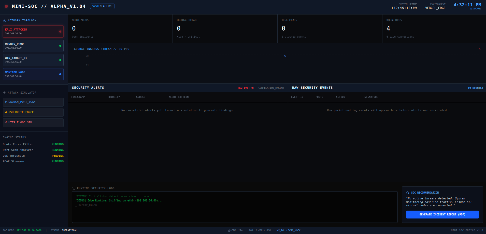
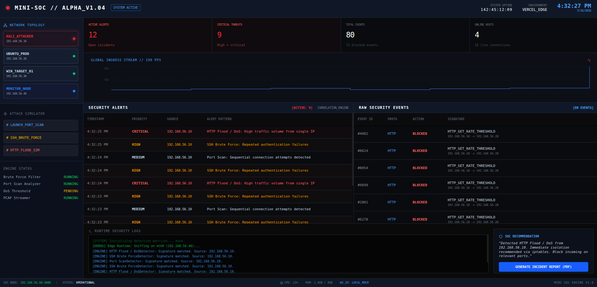

# Mini SOC System

simulation of a ```Security Operations Center (SOC)``` dashboard. This project provides a fully static UI with simulated real-time traffic statistics and security alerts, suitable for demonstration, educational, and professional portfolio purposes.

### **[View Live Demo](https://soc-system-omega.vercel.app/)** 👁️

## Table of Contents

- [Architecture and Features](#architecture-and-features)
- [Visual Overview](#visual-overview)
- [Project Documentation](#project-documentation)
- [Technical Stack](#technical-stack)
- [Local Development](#local-development)
- [Deployment](#deployment)

## Architecture and Features

- **Threat Simulation Engine**: Client-side generation of Port Scans, SSH Brute Force, and HTTP Flood (DoS) attacks.
- **Real-Time Telemetry**: Dynamic charting of network metrics using Recharts.
- **SOC Metrics Dashboard**: Active Alerts, Critical Threats, Total Events, and Online Hosts counters for quick analyst triage.
- **Incident Evidence Stream**: Active logging and categorization of simulated security alerts.
- **Raw Security Events**: Frontend-only packet/log event generation that shows the evidence behind each correlated alert.
- **Topology Mapping**: Visual representation of the mock network environment.
- **Automated Reporting**: Built-in capability to generate and export Incident Reports in PDF format directly from the dashboard.

## Visual Overview

  
  _The primary monitoring interface displaying baseline traffic and topology._


  _The interface responding to a simulated HTTP Flood, showcasing telemetry spikes and critical alerts._

## Project Documentation

Detailed documentation, certification, and project status updates are maintained in separate, organized modules for a cleaner architecture:

- **[Project Status and Milestones](docs/STATUS.md)**: Current build status, features, and future roadmap.
- **[Course Certification and Diploma](docs/DIPLOMA.md)**: Documentation regarding background studies and project validity.
- **[Example Incident Report (PDF)](public/assets/incident_report.pdf)**: Example of the system's automated PDF export feature.

## Technical Stack

- **React 19**: Modern component-based UI architecture.
- **Vite**: High-performance build tool and development server.
- **Tailwind CSS v4**: Utility-first styling framework.
- **Framer Motion**: Fluid UI animations and transitions.
- **Recharts**: Data visualization.
- **Lucide React**: Vector typography and iconography.

## Local Development

To run this project locally:

1. **Install Dependencies:**

   ```bash
   npm install
   ```

2. **Start the Development Server:**

   ```bash
   npm run dev
   ```

   Navigate to the local URL provided in your terminal.

3. **Build for Production:**
   ```bash
   npm run build
   ```

## Deployment

This project requires exactly zero backend components and is structurally optimized for static deployment on **Vercel**.

1. Connect your GitHub repository to Vercel.
2. Ensure the Framework Preset is set to **Vite**.
3. Use the Default Build Command: `npm run build`
4. The application handles route fallbacks natively using the provided `vercel.json`.
